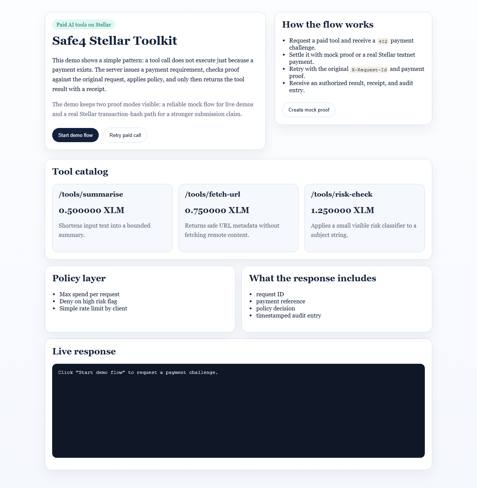

# Safe4 Stellar Toolkit

Safe4 Stellar Toolkit is middleware for paid AI tools on Stellar. It puts a
small control layer between a tool call and execution: the client must present
payment proof, the server still enforces policy, and every successful call
returns a receipt plus an audit entry.



## What It Does

- protects paid AI tool endpoints with a `402` payment requirement
- binds payment proof to a specific tool call and request ID
- enforces explicit policy before tool execution
- returns a receipt and append-only audit record with every decision
- keeps the payment flow simple enough to demo in under two minutes

## Why Stellar

Stellar is actively investing in agentic payment rails such as x402 on Stellar
and MPP. That makes it a strong venue for showing that paid AI tools should not
execute on payment alone: they also need policy checks, request binding, and
receipts.

## What Is Implemented

- three paid tool endpoints:
  - `POST /tools/summarise`
  - `POST /tools/fetch-url`
  - `POST /tools/risk-check`
- a thin Stellar payment adapter
- a reliable mock settlement flow for hackathon demos
- a real Stellar transaction-hash verification path against Horizon data
- preview x402 wire headers:
  - `PAYMENT-REQUIRED`
  - `PAYMENT-SIGNATURE`
  - `PAYMENT-RESPONSE`
- optional facilitator-aware x402 preview seam
- public x402 facilitator demo sidecar under our control
- MPP Charge preview guide and challenge framing
- Node sidecar demo for real `@stellar/mpp` Charge flows
- visible policy controls:
  - max spend per request
  - deny on high risk flag
  - simple rate limiting
- receipt and audit output
- a tiny browser demo at `GET /demo`

Protocol status:
- [`docs/PROTOCOL_STATUS.md`](docs/PROTOCOL_STATUS.md)

## Tool Catalog

| Tool | Price | Purpose |
| --- | --- | --- |
| `summarise` | `0.500000` | Summarise a block of text with a bounded output |
| `fetch-url` | `0.750000` | Return safe URL metadata without fetching remote content |
| `risk-check` | `1.250000` | Run a simple subject-level risk classification |

## Verified Today

- real Stellar testnet XLM payment flow exercised successfully
- verified transaction hash:
  - `ef0bcfd7c46f1f47d7c3769f60a0a9b12886bb96a67ef6b51f994acb4d2c3b83`
- live x402 facilitator inspection path:
  - `https://toolkit-api-production-a04c.up.railway.app/protocols/x402/facilitator`
- live x402 facilitator sidecar:
  - `https://x402-facilitator-demo-production.up.railway.app`
- verification notes:
  - [`docs/TESTNET_VERIFICATION.md`](docs/TESTNET_VERIFICATION.md)

## Quickstart

You can get from clone to first authorized tool call quickly. For the shortest
path, start in `mock` mode. For the stronger hackathon path, switch to
`transaction_hash` mode and use a real Stellar testnet payment.

Requirements:
- Python 3.13 recommended

Install:

```powershell
python -m venv .venv
.venv\Scripts\Activate.ps1
python -m pip install --upgrade pip
python -m pip install -r requirements.txt
Copy-Item .env.example .env
```

For the simplest real testnet demo, keep:

```powershell
SAFE4_STELLAR_ASSET_CODE=XLM
SAFE4_STELLAR_ASSET_ISSUER=
```

and set `SAFE4_STELLAR_DESTINATION` to a funded Stellar testnet receiving account.

Optional x402 preview configuration:

```powershell
SAFE4_STELLAR_VERIFICATION_MODE=x402_facilitator_preview
SAFE4_X402_FACILITATOR_URL=https://channels.openzeppelin.com/x402/testnet
SAFE4_X402_FACILITATOR_API_KEY=<OPTIONAL_TESTNET_API_KEY>
```

In that mode, inspect:
- `GET /protocols/x402/facilitator`
- `GET /payments/x402/guide`

Facilitator deployment reference:
- [`docs/X402_FACILITATOR_SETUP.md`](docs/X402_FACILITATOR_SETUP.md)
- [`docs/X402_RELAYER_DEMO.md`](docs/X402_RELAYER_DEMO.md)
- [`docs/X402_FACILITATOR_DEMO.md`](docs/X402_FACILITATOR_DEMO.md)

Live public facilitator demo:
- `https://x402-facilitator-demo-production.up.railway.app/health`
- `https://x402-facilitator-demo-production.up.railway.app/supported`

Optional MPP Charge preview configuration:

```powershell
SAFE4_STELLAR_VERIFICATION_MODE=mpp_charge_preview
```

In that mode, inspect:
- `GET /protocols/mpp/charge`
- `GET /payments/mpp/charge/guide`

Real local MPP Charge demo asset:

```powershell
npm install
Copy-Item .env.mpp.example .env.mpp
npm run mpp:server
npm run mpp:client
```

Reference:
- [`docs/MPP_CHARGE_DEMO.md`](docs/MPP_CHARGE_DEMO.md)

Run:

```powershell
python -m uvicorn apps.api.main:app --host 0.0.0.0 --port 8080
```

Or:

```powershell
python apps/api/main.py
```

Test:

```powershell
python -m unittest discover -s tests -q
```

Optional screenshot capture for the submission:

```powershell
npm install
npm run capture:screenshots
```

## Real Testnet Helpers

Create and fund a payer account:

```powershell
python scripts/create_testnet_account.py
```

Run the real end-to-end testnet demo:

```powershell
python scripts/run_testnet_payment_demo.py --source-secret <STELLAR_SECRET>
```

## Demo Flow

1. Call a paid tool with no payment proof.
2. Receive `402` plus a Stellar payment requirement.
3. Either settle through the mock path or pay on Stellar testnet and create a transaction-hash proof.
4. Retry the exact same tool call with `Authorization: Payment <token>` and the original `X-Request-Id`.
5. The server verifies the payment context and runs policy checks.
6. Tool output, receipt, and audit record are returned.

## Primary Endpoints

- `GET /health`
- `GET /tools`
- `GET /protocols/status`
- `GET /protocols/x402/facilitator`
- `GET /protocols/mpp/charge`
- `GET /protocols/mpp/session`
- `POST /payments/mock/settle`
- `POST /payments/transaction-hash-proof`
- `GET /payments/x402/guide`
- `GET /payments/mpp/charge/guide`
- `POST /tools/summarise`
- `POST /tools/fetch-url`
- `POST /tools/risk-check`
- `GET /audit/entries`
- `GET /demo`

## Real Testnet Path

Set:

```powershell
$env:SAFE4_STELLAR_VERIFICATION_MODE="transaction_hash"
```

Then:
1. call a paid tool and capture the returned `request_id`, destination, amount, asset, and memo
2. submit a matching Stellar testnet payment with that memo
3. exchange the tx hash for a Safe4 payment token at `POST /payments/transaction-hash-proof`
4. retry the tool call with `Authorization: Payment <token>` and `X-Request-Id`

The verifier checks:
- transaction success
- memo binding
- challenge expiry
- destination account
- asset code and issuer
- paid amount
- payer binding

## Protocol Position

- current strongest live path:
  - real Stellar testnet transaction-hash verification
- current x402 status:
  - preview wire/header surface with optional facilitator seam
- current MPP status:
  - MPP Charge preview plus MPP Session planned

This repo does not yet claim complete Stellar x402 or MPP support. It exposes a
clear middleware boundary today and is being extended toward those protocols.

Important demo note:
- `mock` settlement is only accepted when `SAFE4_STELLAR_VERIFICATION_MODE=mock`
- `transaction_hash` mode does not silently fall back to mock proofs

## Repo Layout

- `apps/api/`
  - FastAPI app and demo endpoints
- `apps/demo/`
  - lightweight demo UI
- `apps/mpp_demo/`
  - Node sidecar for real `@stellar/mpp` Charge demos
- `packages/middleware/`
  - request binding, receipts, audit, and payment-gating flow
- `packages/stellar/`
  - thin Stellar adapter
- `packages/policies/`
  - explicit policy engine and rate limiting
- `docs/`
  - hackathon packaging docs
- `scripts/`
  - testnet account setup and real payment demo helpers

Deployment notes:
- [`docs/DEPLOYMENT.md`](docs/DEPLOYMENT.md)

## Reading Order

1. `README.md`
2. `HACKATHON_SUBMISSION.md`
3. `docs/PROTOCOL_STATUS.md`
4. `docs/TESTNET_VERIFICATION.md`
5. `STELLAR_ADAPTATION.md`
6. `DEMO_SCRIPT.md`
7. `apps/api/main.py`
8. `packages/middleware/firewall.py`
9. `packages/stellar/adapter.py`
